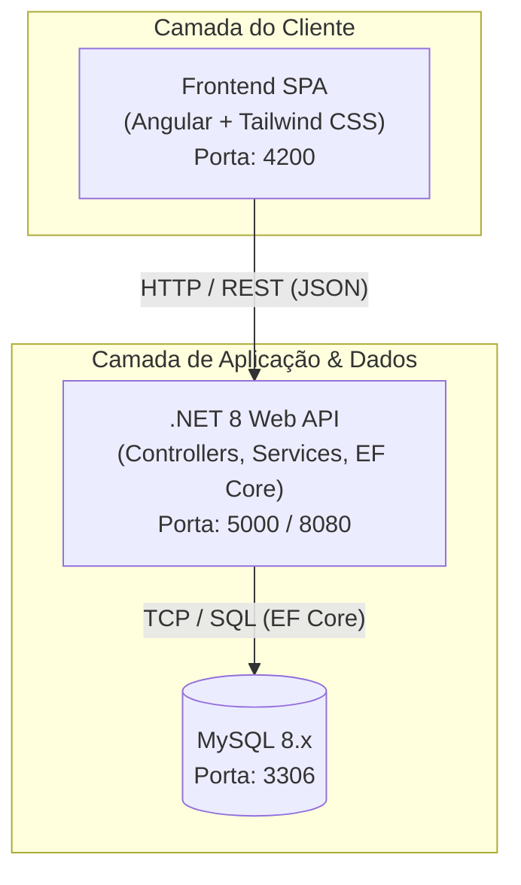
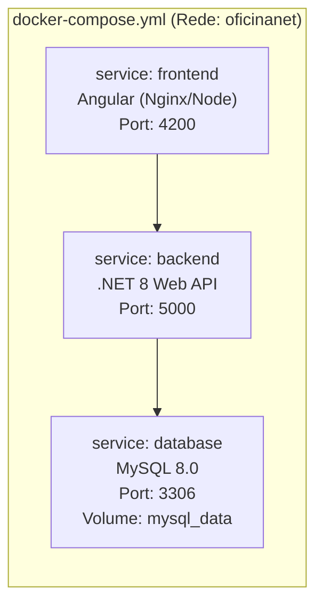
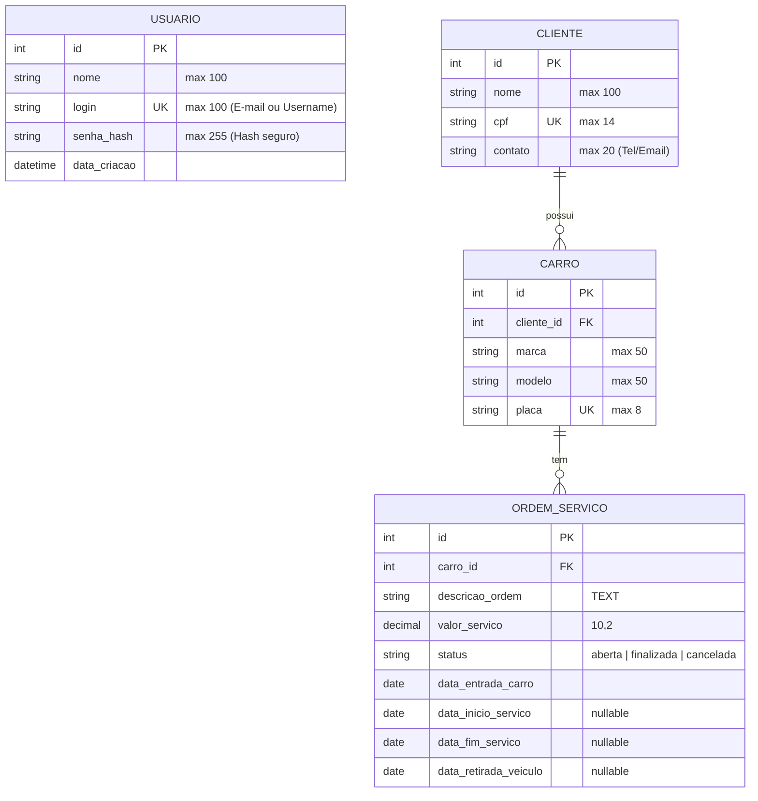
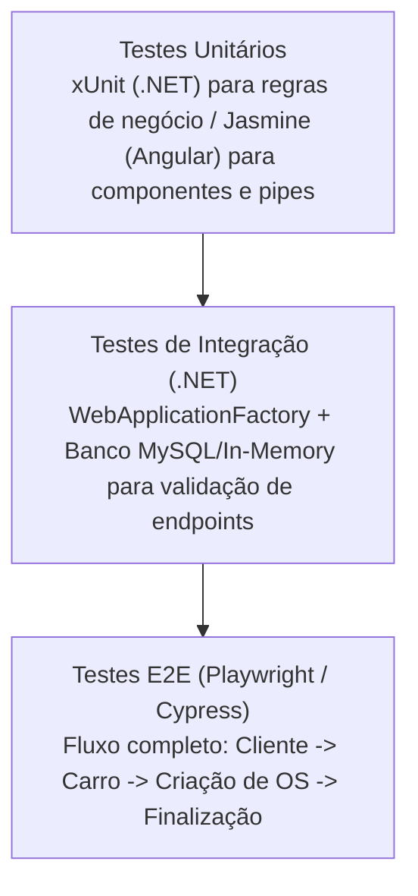
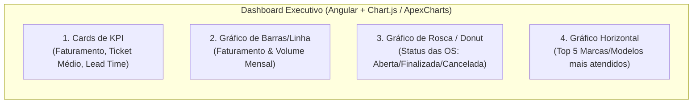

# Documento de Especificação de Arquitetura de Software

**Projeto:** Sistema de Gestão de Ordens de Serviço para Oficina Mecânica (ERP Mecânica v2)  
**Disciplina/Contexto:** Projeto Integrador / Engenharia de Software  
**Versão:** 1.1  
**Data:** 20/09/2026  

---

## 1. Visão Geral do Projeto

### 1.1 Objetivo
Desenvolver uma solução web moderna para controle operacional de oficinas mecânicas, com foco no fluxo completo de clientes, veículos e ordens de serviço (OS) — desde a entrada do veículo, diagnóstico, acompanhamento de datas e valores, até a finalização e retirada.

### 1.2 Escopo e Mapeamento de Requisitos Acadêmicos

| Requisito Acadêmico | Solução Técnica Adotada | Detalhes / Justificativa |
| :--- | :--- | :--- |
| **Framework Web (Frontend)** | Angular + Tailwind CSS | Single Page Application (SPA) reativa, componentização modular e interface responsiva. |
| **Script Web (JS/TS)** | TypeScript / JavaScript | Validações em tempo real, manipulação de estado (Signals/RxJS) e interatividade client-side. |
| **Backend & APIs** | .NET 8 (C#) Web API | Arquitetura RESTful de alta performance, injeção de dependência e tipagem estática robusta. |
| **Banco de Dados** | MySQL 8.x | Banco de dados relacional com Entity Framework Core (ORM) e migrations code-first. |
| **Nuvem (Cloud)** | Agnóstica (Docker / OCI) | Aplicação 100% conteinerizada, pronta para deploy em qualquer provedor de nuvem (PaaS/IaaS). |
| **Ambiente Local** | Docker Compose | Orquestração completa dos serviços (`frontend`, `backend`, `mysql`) em um único comando. |
| **Uso de API** | RESTful Web API (.NET 8) | Comunicação desacoplada client-server via HTTP/JSON com documentação OpenAPI/Swagger. |
| **Acessibilidade (a11y)** | Padrões WCAG 2.1 (Nível AA) | Semântica HTML5, atributos WAI-ARIA, paleta com contraste adequado e navegação via teclado. |
| **Controle de Versão** | Git + GitHub | Estratégia GitHub Flow, Conventional Commits e revisões obrigatórias por Pull Request. |
| **CI/CD** | GitHub Actions | Workflows automatizados para linting, compilação, testes automatizados e geração de imagens Docker. |
| **Pirâmide de Testes** | Unitários, Integrados e E2E | xUnit/Moq (.NET), Jasmine/Karma (Angular), `WebApplicationFactory` (Integração) e Playwright/Cypress (E2E). |
| **Análise de Dados (Opcional)** | Dashboard Analítico | Gráficos de volume de OS por status, tempo médio de permanência e faturamento total. |

---

## 2. Arquitetura do Sistema

### 2.1 Diagrama de Contêineres e Comunicação



---

## 3. Ambiente Local com Docker Compose

Para garantir paridade entre ambientes de desenvolvimento e facilitar a execução da equipe, a infraestrutura completa é orquestrada via Docker Compose:



* **Vantagens:**
  * Subida de todo o ecossistema com `docker compose up -d`.
  * Banco de dados MySQL pré-configurado com volume persistente.
  * Backend com suporte a hot-reload ou build automático.

---

## 4. Modelo Entidade-Relacionamento (MER / DER)

O modelo de dados é focado em 3 entidades centrais consolidadas, herdando e padronizando as regras de negócio do projeto:

### 4.1 Diagrama Entidade-Relacionamento (Mermaid)



### 4.2 Dicionário de Dados

1. **Tabela `usuarios` (Autenticação do Sistema):**
   * `id` (INT, PK, Auto-increment) — Identificador único do usuário
   * `nome` (VARCHAR(100), NOT NULL) — Nome completo do operador/mecânico
   * `login` (VARCHAR(100), UNIQUE, NOT NULL) — Login de acesso (e-mail ou nome de usuário)
   * `senha_hash` (VARCHAR(255), NOT NULL) — Hash criptografado da senha (armazenado com BCrypt / PBKDF2)
   * `data_criacao` (DATETIME, NOT NULL, DEFAULT NOW()) — Data e hora do cadastro do usuário
2. **Tabela `clientes`:**
   * `id` (INT, PK, Auto-increment)
   * `nome` (VARCHAR(100), NOT NULL)
   * `cpf` (VARCHAR(14), UNIQUE, NOT NULL) — Formato `000.000.000-00`
   * `contato` (VARCHAR(20), NOT NULL) — Telefone ou E-mail para contato
3. **Tabela `carros`:**
   * `id` (INT, PK, Auto-increment)
   * `cliente_id` (INT, FK -> clientes.id, NOT NULL, ON DELETE CASCADE)
   * `marca` (VARCHAR(50), NOT NULL)
   * `modelo` (VARCHAR(50), NOT NULL)
   * `placa` (VARCHAR(8), UNIQUE, NOT NULL) — Formato `ABC-1234` ou `ABC1D23` (Mercosul)
4. **Tabela `ordens_servico`:**
   * `id` (INT, PK, Auto-increment)
   * `carro_id` (INT, FK -> carros.id, NOT NULL, ON DELETE CASCADE)
   * `descricao_ordem` (TEXT, NOT NULL) — Descrição do defeito e do serviço a ser executado
   * `valor_servico` (DECIMAL(10,2), NOT NULL) — Valor financeiro acordado
   * `status` (VARCHAR(20), NOT NULL) — Valores válidos: `'aberta'`, `'finalizada'`, `'cancelada'`
   * `data_entrada_carro` (DATE, NOT NULL) — Data em que o carro deu entrada na oficina
   * `data_inicio_servico` (DATE, NULL) — Início da manutenção
   * `data_fim_servico` (DATE, NULL) — Conclusão do conserto
   * `data_retirada_veiculo` (DATE, NULL) — Retirada pelo cliente

---

## 5. Especificação das Camadas e Tecnologias

### 5.1 Frontend (Angular + Tailwind CSS)
* **Framework:** Angular (versão LTS com Standalone Components).
* **Estilização:** Tailwind CSS para layouts responsivos, modais e componentes visuais.
* **Autenticação & Cadastro:**
  * Telas dedicadas de **Login** e **Cadastro de Usuário** (formulários reativos com validação de campos obrigatórios e confirmação de senha).
  * `AuthService` com métodos para login, registro e armazenamento seguro de token JWT no `localStorage`/`sessionStorage`.
  * `AuthGuard` para proteção de rotas privadas (redirecionamento automático para a tela de login caso não autenticado).
  * `HttpInterceptor` para anexar o cabeçalho `Authorization: Bearer <token>` em requisições autenticadas.
* **Gerenciamento de Estado & Reatividade:** Signals e RxJS para manipulação de formulários reativos e listagens em tempo real.
* **Acessibilidade:**
  * Uso de elementos semânticos (`<main>`, `<nav>`, `<section>`, `<header>`, `<footer>`).
  * Formulários com `<label>` explicitamente associados via `for`/`id` e mensagens de erro legíveis por leitores de tela.
  * Contrastes de cores em conformidade com WCAG 2.1 AA.
  * Navegação facilitada por teclado (`Tab`, `Enter`, `Esc` para fechar modais).

### 5.2 Backend (.NET 8 Web API)
* **Linguagem & Framework:** C# / .NET 8 Web API.
* **Módulo de Autenticação & Usuários:**
  * Endpoints REST para autenticação (`/api/v1/auth/login`) e cadastro de novos usuários (`/api/v1/auth/register`).
  * Hashing de senhas com algoritmo seguro (BCrypt / PBKDF2), garantindo que a senha nunca seja salva em texto puro.
  * Emissão de token JWT com tempo de expiração configurado.
  * Carga inicial (*Data Seeding*) com usuário padrão (`admin@oficina.com` / `Admin@123`) para facilitar testes locais e avaliação.
* **Arquitetura em Camadas:**
  * **Controllers / API:** Endpoints REST, tratamento global de exceções, documentação Swagger/OpenAPI.
  * **Services / Application:** Regras de negócio, DTOs de entrada/saída, validações de dados.
  * **Domain / Entities:** Modelos de domínio (`Usuario`, `Cliente`, `Carro`, `OrdemServico`) gerados via scaffolding reverso.
  * **Infrastructure / Data:** Contexto do Entity Framework Core (`AppDbContext`), mapeamentos e repositórios.

### 5.3 Banco de Dados (MySQL 8.x)
* **Abordagem:** *Database-First* / Script-First.
* **Criação do Esquema:** Scripts DDL em SQL (`init.sql`) versionados no repositório e executados automaticamente na inicialização do contêiner MySQL.
* **Engenharia Reversa (Scaffolding):** Geração automática das classes de modelo e do `AppDbContext` via CLI do EF Core (`dotnet ef dbcontext scaffold` com `Pomelo.EntityFrameworkCore.MySql`).

---

## 6. Design da API REST (Endpoints)

A API segue as convenções REST, utilizando verbos HTTP apropriados e respostas em formato JSON.

| Recurso | Método | Rota | Descrição |
| :--- | :--- | :--- | :--- |
| **Autenticação** | `POST` | `/api/v1/auth/register` | Cadastra um novo usuário no sistema (nome, login e senha). |
| **Autenticação** | `POST` | `/api/v1/auth/login` | Valida credenciais (login/senha) e retorna o Token JWT. |
| **Autenticação** | `GET` | `/api/v1/auth/me` | Retorna os dados do usuário autenticado no momento. |
| **Clientes** | `GET` | `/api/v1/clientes` | Lista todos os clientes (com suporte a busca por nome/CPF). |
| **Clientes** | `POST` | `/api/v1/clientes` | Cadastra um novo cliente. |
| **Clientes** | `GET` | `/api/v1/clientes/{id}` | Obtém os dados de um cliente específico e seus veículos. |
| **Clientes** | `PUT` | `/api/v1/clientes/{id}` | Atualiza os dados do cliente. |
| **Clientes** | `DELETE` | `/api/v1/clientes/{id}` | Remove um cliente e seus registros vinculados em cascata. |
| **Carros** | `GET` | `/api/v1/carros` | Lista veículos cadastrados. |
| **Carros** | `POST` | `/api/v1/carros` | Cadastra um novo veículo vinculado a um cliente. |
| **Carros** | `GET` | `/api/v1/carros/{id}` | Obtém detalhes do veículo e histórico de ordens de serviço. |
| **Carros** | `PUT` | `/api/v1/carros/{id}` | Atualiza dados do veículo. |
| **Carros** | `DELETE` | `/api/v1/carros/{id}` | Remove um veículo. |
| **Ordens de Serviço** | `GET` | `/api/v1/ordens` | Lista ordens de serviço (com filtros por status, data e placa). |
| **Ordens de Serviço** | `POST` | `/api/v1/ordens` | Registra uma nova Ordem de Serviço para um veículo. |
| **Ordens de Serviço** | `GET` | `/api/v1/ordens/{id}` | Obtém detalhes completos da OS (datas, valores, dados do carro e cliente). |
| **Ordens de Serviço** | `PUT` | `/api/v1/ordens/{id}` | Atualiza dados gerais da OS. |
| **Ordens de Serviço** | `PATCH` | `/api/v1/ordens/{id}/status` | Atualiza especificamente o status e preenche as datas correspondentes. |
| **Dashboard** | `GET` | `/api/v1/dashboard` | Retorna métricas consolidadas (total de OS abertas/finalizadas, faturamento). |

---

## 7. Estratégia de Testes

### 7.1 Pirâmide de Testes



* **Testes Unitários:** Validação de transições de status válidas, regras de cálculo e validação de formato de CPF/Placa.
* **Testes de Integração:** Testes de requisição HTTP direta contra os controllers e persistência no banco.
* **Testes E2E:** Simulação das interações do usuário na interface web.

---

## 8. Integração Contínua e Entrega Contínua (CI/CD)

* **Pipeline via GitHub Actions:**
  1. **Build & Lint:** Validação sintática do código TypeScript/Angular e C#/.NET.
  2. **Testes:** Execução automatizada das suítes de testes unitários e de integração a cada Pull Request.
  3. **Docker Build:** Geração das imagens de contêiner do Frontend e Backend para publicação em nuvem.

---

## 9. Módulo de Análise de Dados e Indicadores (Dashboard BI)

O módulo analítico transforma os registros transacionais das Ordens de Serviço em inteligência operacional e financeira para a gestão da oficina.

### 9.1 Indicadores de Negócio (KPI Cards)

* **Faturamento Total / Mensal:** Soma do `valor_servico` das ordens com status `'finalizada'`.
* **Ticket Médio por OS:** Relação direta entre o faturamento total e a quantidade de ordens finalizadas.
* **Lead Time Médio de Reparo (Tempo de Oficina):** Média em dias calculada entre a entrada do carro (`data_entrada_carro`) e o término do serviço (`data_fim_servico`).
* **Taxa de Eficiência / Conversão:** Distribuição percentual entre OS finalizadas, em andamento (abertas) e canceladas.

### 9.2 Visualizações e Gráficos (Frontend Angular)



1. **Evolução Financeira Mensal:** Gráfico combinado de barras e linhas demonstrando faturamento x volume de serviços por mês.
2. **Distribuição de Ordens por Status:** Gráfico de rosca para rápida visualização do percentual de serviços em aberto vs finalizados vs cancelados.
3. **Top 5 Marcas / Modelos Atendidos:** Gráfico de barras horizontal identificando quais montadoras geram maior demanda na oficina (cruzamento de dados `OrdemServico` -> `Carro.marca`).
4. **Tempo Médio no Pátio (Pós-Serviço):** Indicador de tempo entre `data_fim_servico` e `data_retirada_veiculo`, medindo eficiência de liberação de espaço físico.

### 9.3 Arquitetura de Agregação e Contrato JSON

Para garantir máxima performance, os cálculos são processados no banco de dados via consultas agregadas do Entity Framework Core (`GroupBy`, `SumAsync`, `AverageAsync`) e entregues por meio de um endpoint consolidado:

* **Endpoint:** `GET /api/v1/dashboard`
* **Exemplo de Resposta (Payload JSON):**

```json
{
  "kpis": {
    "faturamentoTotal": 45800.00,
    "ticketMedio": 458.00,
    "tempoMedioReparoDias": 3.2,
    "totalOrdens": 100
  },
  "statusDistribuicao": [
    { "status": "aberta", "quantidade": 15 },
    { "status": "finalizada", "quantidade": 80 },
    { "status": "cancelada", "quantidade": 5 }
  ],
  "faturamentoMensal": [
    { "mes": "Jan/2026", "valor": 12000.00, "quantidade": 25 },
    { "mes": "Fev/2026", "valor": 15500.00, "quantidade": 32 },
    { "mes": "Mar/2026", "valor": 18300.00, "quantidade": 43 }
  ],
  "topMarcas": [
    { "marca": "Volkswagen", "totalOS": 28 },
    { "marca": "Chevrolet", "totalOS": 22 },
    { "marca": "Fiat", "totalOS": 19 },
    { "marca": "Toyota", "totalOS": 16 },
    { "marca": "Ford", "totalOS": 15 }
  ]
}
```
